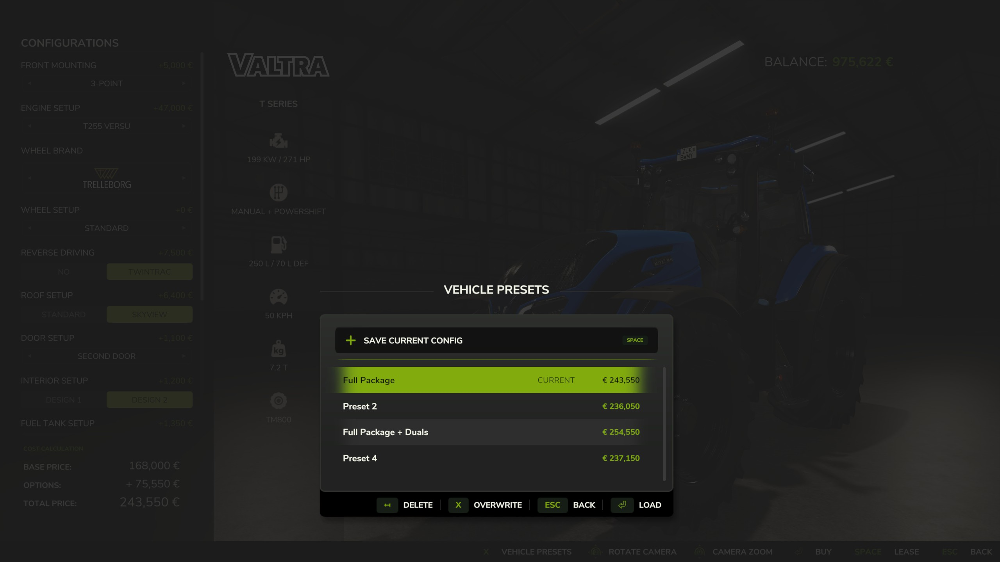
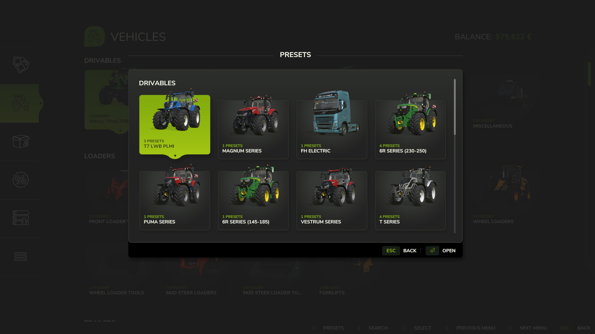
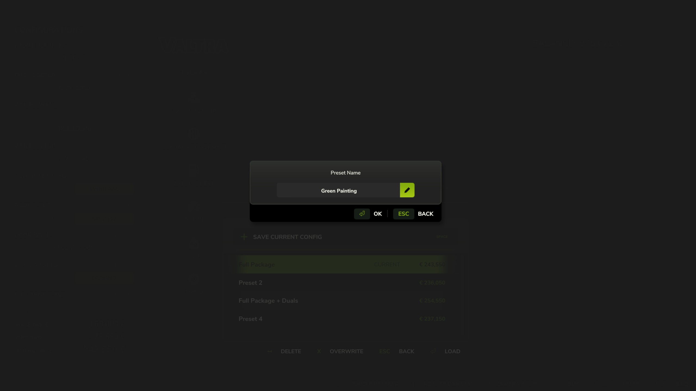

   
  <b>Vehicle Presets</b> adds a touch of convenience to your game &mdash;
   
  save your favorite vehicle configurations for quick and easy access instead of manually configuring them every time.
   
   

## Features

- **Save Presets:** Save up to 10 customized presets per vehicle directly from the shop configuration screen.
- **Comprehensive Support:** Supported configurations include base variants, multiple custom colors, and material changes.
- **Quick Management:** Instantly apply, overwrite, or delete your saved configurations.
- **Global Browser:** Browse all accumulated presets organized by vehicle in the global browser.
- **Automatic Cleanup:** Automatically removes presets for uninstalled mod vehicles.

## Installation

1. Download the latest version of the mod from the [Releases](https://github.com/modnext/vehiclePresets/releases/) page or the official [ModHub](https://www.farming-simulator.com/mod.php?mod_id=358794).
2. Copy the downloaded `.zip` file to your Farming Simulator mods folder:
   - Windows: `Documents\My Games\FarmingSimulator2025\mods\`
   - macOS: `~/Library/Application Support/FarmingSimulator2025/mods/`
   - Linux: `~/FarmingSimulator2025/mods/`
3. Start Farming Simulator 2025 and enable the mod in the Mods menu.

## Keybindings

| Key         | Context                        | Action                                                                   |
| ----------- | ------------------------------ | ------------------------------------------------------------------------ |
| `V`         | Store Pages                    | Open the "All Presets" browser directly                                  |
| `V`         | Shop Configuration Screen      | Open the "Presets" dialog to save, load, overwrite, or delete presets    |

## Screenshots

## License

Distributed under the GPL-3.0 license. See [LICENSE](https://github.com/modnext/vehiclePresets/blob/main/LICENSE) for more information.
